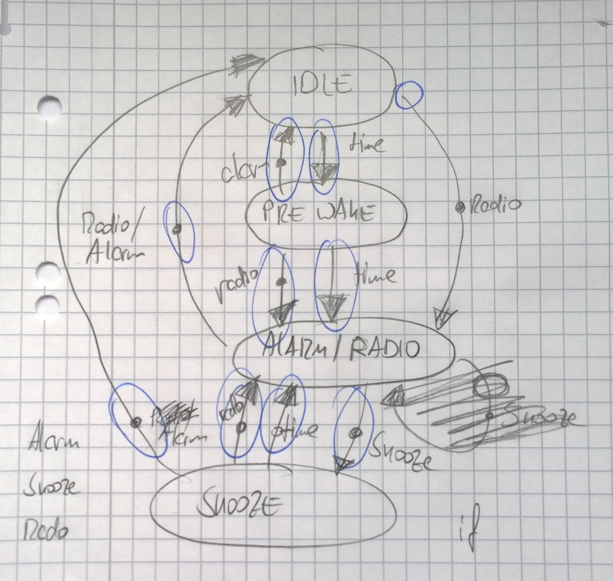

# RaspWakeUp #1 - Basic State Machine

How does an alarm clock work internally?

There must be something like a core loop, that runs each second and checks if the current time is equal to the set alarm. If so, it should start the radio or beep-beep noise and try to wake you up. Easy.

Introducing: Radio Button.

So - regardless of the current time - when the radio is no playing, it should start when the radio button is pressed. If the radio is playing it should stop playing music. Still easy.

Introducing: Sleep Button.

Okay, when the alarm went off, and the sleep button is pressed, the alarm should turn off and back on again in a couple of minutes. But if the radio button is pressed button during that time, the radio should start playing again. Seems like with each button we add, we create a more complex combinations of conditions and possible actions. Grml.

If your code starts to become hard to understand and maintain because of more and more deeply nested if-that-and-that-else-if-that-else-whatever structures, state machines come to the rescue. Everything happening in the alarm clock can be summarized as a state that has a couple of transitions depending on the clock tick and the input we get from our buttons. With good old pen & paper i sketched a couple of states (idle, pre-wake, alarm and snooze) and the possible transitions between them.



While developing a unity prototype some time ago i implemented a very flexible yet simple state machine for the enemy ai using C# Actions. I figured out it will also work for the alarm clock and help me to avoid messy if-if-if-else-if-else trees, that are just not maintainable after you take a break from your code for about one day.

The basic idea is to have a state class with empty Actions defined. These Actions are your input handler, that possibly trigger a state transitions.

```
public class State
{
    public Action OnEnter { get; set; } = () => { }
    public Action OnLeave { get; set; } = () => { }
    public Action<Timespan> OnTick { get; set; } = () => { }
    public Action OnKeyAlarm { get; set; } = () => { }
    public Action OnKeySnooze { get; set; } = () => { }
    public Action OnKeyRadio { get; set; } = () => { }
    public string Name { get; set }
    public State(string name) { Name = name; }
}
```

I've also added two additional Actions for OnEnter and OnLeave, which are used to manage resources and stuff during transitions. For example when entering the radio state, we want to start the radio and when exiting, the playback should be stoppped. The Name property is just for debugging purpose, so can easily identify our current state.

```
public class SateMachine
{
    private State _currentState = new State("Empty");
    
    public State CurrentState {
        get { return _currentState; }
        
        set
        {
            Debug.WriteLine($"# Leaving State {_current.Name}");
            _currentState.OnLeave();
            _currentSate = value:
            Debug.WriteLine($"# Entering State {_current.Name}");
            _currentState.OnEnter();
        }
    }
}
```

Inside our state machine, we create all our states and set the Actions (transitions) we want our state to handle. By using lambdas and putting everything together inside a single class we get a liiitle bit messy, but gain the huge benefit of having all components (radio, display, ...) easily shared between all states. On the other hand the states have no private data. So i you have some extra time and and want to blow up your projects complexity you can of course use an IoC container like [AutoFac](http://autofac.org).

```
private State _idleState;
private State _radioState;
private State _snoozeState;

private void InitStates()
{
    _idleState = new State("Idle")
    {
        OnKeyRadio = () => { CurrentState = _stateRadio; }
        OnTick = (time) =>
        {
            if (time == Configuration.Alarm)
                CurrentState = _alarmState;
        }
    };

    _radioState = new State("Radio")
    {
        OnEnter = () => { RadioComponent.Play(); }
        OnLeave = () => { RadioComponent.Stop(); }
        OnKeyAlarm = () => { CurrentState = _stateIdle; }
        OnKeySnooze = () => { CurrentState = _stateSnooze; }
    };

    CurrentState = _idleState;
    /* you get the idea */
}
```

That's it. A super simple and state machine that can be easily extended with more states and transitions. If you're interesed in some real example code, have a look at one of the the early commits in my [RaspWakeUp](https://github.com/jlorek/RaspWakeUp) repository.

Enjoy! :)