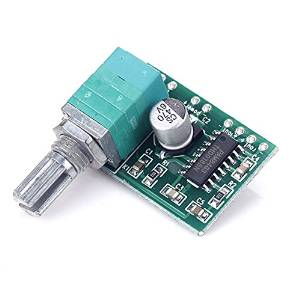

# RaspWakeUp #2 - Noise

Using the [Universal Media Engine](https://github.com/ms-iot/UniversalMediaEngine) on the software side, i was able to setup radio streaming in a couple of minutes. Just add the whole project to your solution and reference it. There is no NuGet package availiable you can use at the moment.

```
mediaEngine = new MediaEngine();
var result = await this.mediaEngine.InitializeAsync();
if (result != MediaEngineInitializationResult.Success)
{
    mediaEngine.Play("http://ice.somafm.com/groovesalad");
}
```

Universal Media Engine wraps the XAML `MediaElement` in a manner that we can run our application in headless mode (without any ui). The only pitfall you have to avoid are frequent calls to the `Play()` method. Even when calling `Stop()` beforehand you want to call and wait for `InitializeAsync()` before you start playback again. Otherwise i experienced random exceptions, which is something you should try to avoid when programming an alarm clock that you must rely on every morning :)

Plugging in my headphones in the Raspberry i could hear some nice [soma.fm](http://somafm.com/player/#/now-playing/groovesalad) tunes. Next off to the hardware side. The radio already included an old 16 ohms 0.8 watts speaker i wanted to re-use. When connecting the speaker with the 3.5mm audio jack i could hear a quiet whispering. After some quick googling and amazoning, a couple of days later a tiny stereo amplifier arrived. Magic is done via a PAM8403 chip, which is sufficient for the small speaker. There are also versions available without a thick potentiometer attached to it, but i was pretty pleased by the idea to have some hardware volume control out of the box (the `MediaEngine` class also exposes a `Volume` property).



Wiring was straightforward. Three pins for input (left/right/ground), four pins for output (stereo) and two pins for 5V power. It's a stereo amplifier but i only have one speaker, so i will have to decide between left or right channel or figure out a way to mix left/right into a single channel via some creative wiring.

The amplifier is pulling the 5v power directly from the pi, which features two 5v output pins. After putting everything together and powering up the pi with my radio software everything works as expected. Sound from speakers, volume controlled via the pot knob. There is only one drawback: **lots of static noise.**

It's barely noticeable when music is playing, but when the pi should be silent, there is a huge amount of random frequencies from the speakers. Even with the volume set to the lowest setting, you could clearly hear the noise. Pretty much a deal breaker for an alarm clock that sits 1 meter away from your head when you are trying to sleep ^^

After some initial disappointment i found [a site](http://www.howtoeverything.net/linux/raspberry-pi/sound-distortions-and-raspberry-pi-reasons-and-solutions) that explains some reasons for audio problems with the pi and also comes with possible solutions:

* use a high-quality usb power adapter to power the pi
* use a usb cable with a [ferrit bead](https://en.wikipedia.org/wiki/Ferrite_bead)
* use an external usb soundcard

While trying the first two options i figured out what *maybe* was happening here. The power consumption of the pi varies, depending on the CPU load and what all plugged peripherals are doing (like the wi-fi dongle). This affects the 5v output that is powering my amplifier, which relies on a constant power input. So i could literally hear the pi working ^^

A workaround for this problem is as simple as using a separate power supply for the amplifier. Which also means that i now have two usb cables leading into the radio. Not the most elegant solution for sure, but it solved my problem. The separate power connection eliminated any static noise and the speaker is not completely silent when no music is playing. I have a strong feeling that using a capacitor *somewhere* would also solve my problem, but that option that will be evaluated when planing RaspWakeUp rev. 2 :)
