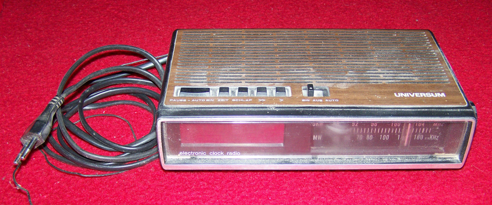
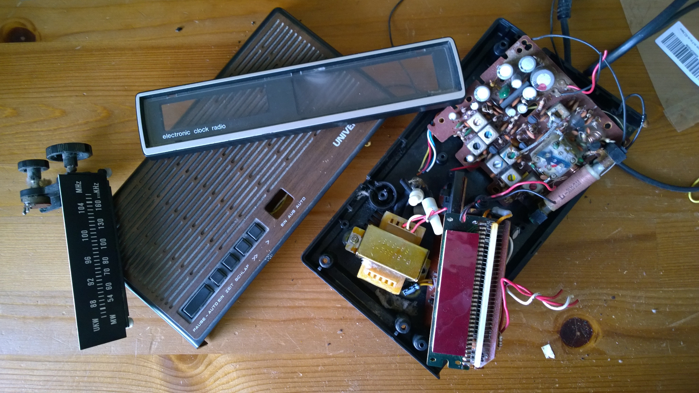
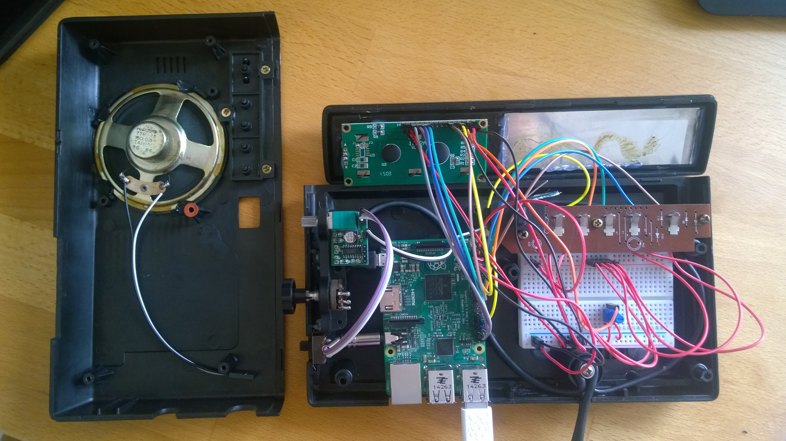

# RaspWakeUp #3 - The great (dis)assemble

The old radio was the cheapest part of my Raspberry Radio project - about 1€ on ebay. It came in pretty good condition (beside being technically broken) and after some initial cleaning i went of to disassemble the good old "Universum UR 1996B" to see if all my components will actually fit into the housing.

The button mechanics are very exposed and work exactly like you would expect a button to work: a small metal flap is pressed down by a plastic button to make contact with another metal pin. It was straight forward to solder these to the pi.

Placing the analog volume control from my little amplifier module was also easy. I could simply put it in place of the old frequency selector on the right and the knob still fitted nicely :)

Most problems came with the display. The original display was on the left side of the radio, but the new LCD was too bulky on the back to fit along the button mechanics. Since i did not want to give up neither the display nor the buttons i was pretty happy to find another solution after some fiddling. I could simply turn the front panel 180° and put the display on the right side of the radio. Top and bottom of the radio still fitted together perfectly. Again this interfered with the placement of my amplifier module but after some dremel and hot glue action everything was in place.

Using an old radio is nice and cheap. The blend of old and new is pretty appealing to me. But until you disassemble everything you can only guess if you can re-use some of the old components like buttons, knobs or even the power supply. Also you cannot be sure that your pi and additional components fit nicely.

So for RaspWakeUp rev. 2 i may want to explore the world of 3d printing and see if with more planing there are less surprises to deal with ^^ Never the less, the hardware is finished (for now) and i can focus on things i can do slightly better - like software development :)